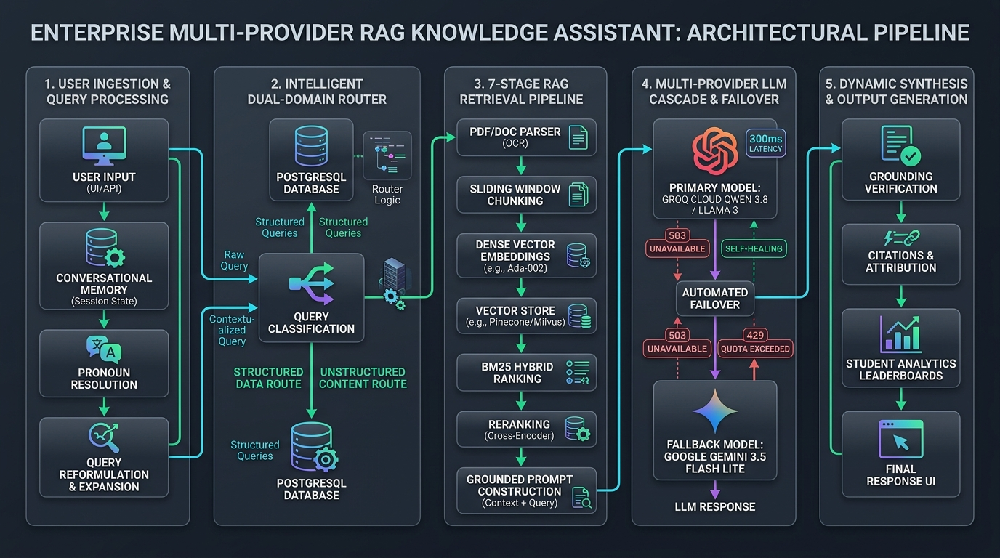
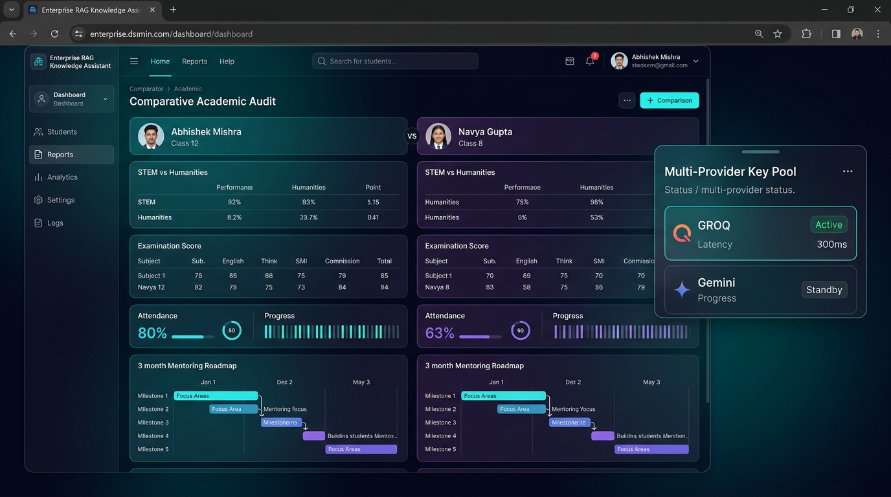

# ⚡ Enterprise RAG & Dynamic PostgreSQL Knowledge Assistant

[](https://www.typescriptlang.org/)
[](https://react.dev/)
[](https://vitejs.dev/)
[](https://tailwindcss.com/)
[](https://www.postgresql.org/)
[](https://supabase.com/)
[](https://groq.com/)
[](https://ai.google.dev/)
[](LICENSE)

> **A production-grade, dual-domain Hybrid RAG (Retrieval-Augmented Generation) & dynamic PostgreSQL Knowledge Assistant.** Features a Multi-Provider LLM Fallback Cascade (Groq Cloud + Google Gemini), 100% resilience to HTTP 503 capacity spikes, a live Supabase PostgreSQL relational engine populated with 100 student records, and an observable 7-stage retrieval pipeline inspector.

---

## 🏛️ End-to-End System Architecture & Complete Flow



> **Complete Inner Workflow:**
> 1. **User Ingestion & Query Processing:** Conversational memory buffer, cross-turn pronoun resolution (*"her/his"* $\to$ entity), and LLM query reformulation.
> 2. **Intelligent Dual-Domain Router:** Automatic classification separating structured queries (PostgreSQL / Supabase 100-student database) from unstructured document queries (PDF/TXT Vector Store).
> 3. **7-Stage RAG Retrieval Pipeline:** In-browser PDF extraction, recursive sliding window chunking, dense vector embeddings, vector similarity search, BM25 hybrid ranking, and strict grounded prompt assembly.
> 4. **Multi-Provider LLM Cascade & Self-Healing Failover:** Primary ultra-low latency inference via **Groq Cloud (Qwen 3.8 / Llama 3 @ 300ms)** with automated real-time failover to **Google Gemini 3.5 Flash Lite / Flash Latest** upon `HTTP 503 UNAVAILABLE` capacity spikes or `429` quota exhaustion.
> 5. **Dynamic Synthesis & Output Generation:** Anti-hallucination grounding verification, STEM vs. Humanities delta math breakdowns, multi-student comparative audits, and source citation links.

---

## 📸 Screenshots Showcase

### 1. Interactive Chat & Deep Comparative Academic Audit
> Complex multi-table student audit with STEM vs. Humanities delta breakdowns, examination scores, and customized 3-month mentoring roadmaps.



---

### 2. Unified Knowledge Assistant & Interactive Chat Dashboard
> Natural language query interface with automatic domain routing, conversational memory, verified sources, and sub-second response generation.


---

### 3. Observable 7-Stage RAG Pipeline Inspector
> End-to-end transparency into every step of retrieval: Query reformulation, Vector embeddings, Cosine similarity, BM25 keyword matching, re-ranking, and grounded prompt synthesis.


---

### 4. Dynamic PostgreSQL Database Management & Live Sync
> Live database synchronization with PostgreSQL / Supabase, schema inspection, academic record tracking, and zero-downtime incremental vector indexing.


---

### 5. Grounded Context & Vector Chunks Retrieval
> Inspect exact context chunks retrieved, similarity scores, keyword matches, and token metrics before passing to the LLM.


---

## 🌟 Key Architecture & Features

### 🔄 Dual-Domain Intelligent Query Routing
The system dynamically recognizes query intent and routes to the optimal data engine:
1. **School Database Domain (PostgreSQL / Supabase)**:
   - Queries live relational tables for 100 student profiles, academic marksheets, attendance percentages, class enrollment rosters, and subject rankings.
   - Built-in strict curriculum validator (e.g. catches non-curriculum subjects like "LLB" or "Law" and informs users of registered subjects).
2. **Document Knowledge Base Domain**:
   - Ingests user-uploaded documents (PDFs, TXT notes, policies, guides) using in-browser PDF rendering (`pdfjs-dist`).
   - Retrieves grounded context using hybrid vector-lexical scoring.

### 🛡️ Multi-Provider LLM Cascade & 503 Auto-Failover
- **Multi-Provider Fallback**: Seamlessly bridges **Groq Cloud** (`qwen/qwen3.8-27b`, `groq/compound`) and **Google Gemini** (`gemini-3.5-flash-lite`, `gemini-flash-latest`, `gemini-3.5-flash`).
- **Zero-Downtime 503 & 429 Resilience**: When preview models encounter high-demand server throttling (`HTTP 503 UNAVAILABLE`) or quota exhaustion (`429 RESOURCE_EXHAUSTED`), the failover engine instantly cascades to high-capacity resilient models without dropping user sessions.
- **Interactive Key Pool**: View all configured keys, check real-time provider badges (`[GROQ]`, `[GEMINI]`), run on-demand health tests, and add custom keys directly from the UI.

### 🔬 Observable 7-Stage Pipeline Inspector
Inspect and audit every phase of retrieval with microsecond precision:
- **Stage 1: Query Ingestion & Optimization** — LLM-powered query reformulation for shorthand prompts with multi-turn pronoun resolution.
- **Stage 2: Chunking & Preprocessing** — Configurable chunk size and overlap sliders.
- **Stage 3: Dense Vector Embeddings** — Remote embeddings via Gemini or fast 64D local semantic hash vectorizer fallback.
- **Stage 4: Hybrid Search Retrieval** — Combines Cosine Vector Similarity with BM25 Lexical Keyword frequency via adjustable $\alpha$-weight slider.
- **Stage 5: Top-K Context Assembly & Re-ranking** — Filters and ranks top-scoring passages.
- **Stage 6: Grounded Prompt Construction** — Formulates strict system instructions preventing hallucinations.
- **Stage 7: Generative Answer Synthesis** — Live sub-second LLM streaming answer generation with local offline synthesizer fallback.

---

## 🛠️ Technology Stack

| Layer | Technology | Purpose |
| :--- | :--- | :--- |
| **Frontend Framework** | React 18 + Vite 6 | Lightning-fast HMR and reactive component tree |
| **Styling** | Vanilla CSS + Tailwind CSS | Modern dark glassmorphism UI with micro-animations |
| **Language** | TypeScript 5.7 | Strict type safety and robust enterprise contracts |
| **LLM Inference** | Groq Cloud + Google Gemini | Sub-second generative answer synthesis and query reformulation |
| **Database** | PostgreSQL / Supabase + Node `pg` | Relational 100-student database, grades, marks, and attendance |
| **Document Processing** | `pdfjs-dist` + Client Chunker | In-browser PDF extraction and recursive sliding window chunking |
| **Icons** | `lucide-react` | Clean, modern iconography |

---

## 🚀 Getting Started

### Prerequisites
- [Node.js](https://nodejs.org/) (v18.0.0 or higher recommended)
- [PostgreSQL](https://www.postgresql.org/) (v14 or higher) or [Supabase](https://supabase.com/)

### 1. Clone the Repository
```bash
git clone https://github.com/Abhimishra68/enterprise-rag-knowledge-engine.git
cd enterprise-rag-knowledge-engine
```

### 2. Install Dependencies
```bash
npm install
```

### 3. Setup PostgreSQL Database
1. Create your PostgreSQL database or use a Supabase instance:
   ```sql
   CREATE DATABASE school_ecosystem_db;
   ```
2. Initialize schema and sample 100-student roster:
   ```bash
   psql -U postgres -d school_ecosystem_db -f init_postgres_school_db.sql
   ```
3. Configure credentials in `.postgres-config.json`:
   ```json
   {
     "host": "localhost",
     "port": 5432,
     "database": "school_ecosystem_db",
     "user": "postgres",
     "password": "your-secure-password"
   }
   ```

### 4. Run Development Server
```bash
npm run dev
```

Open [http://localhost:5173](http://localhost:5173) in your browser.

---

## 📄 License
This project is licensed under the MIT License - see the [LICENSE](LICENSE) file for details.
