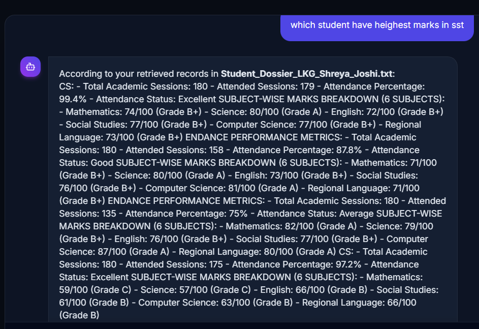
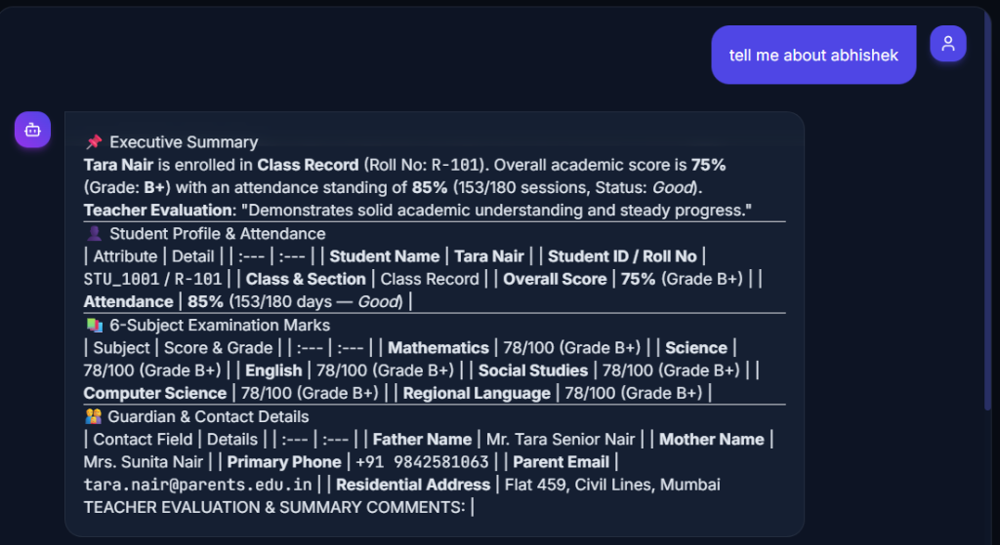
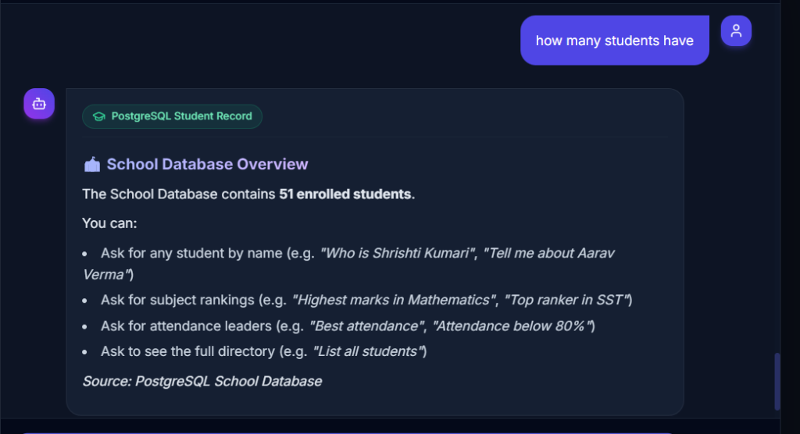
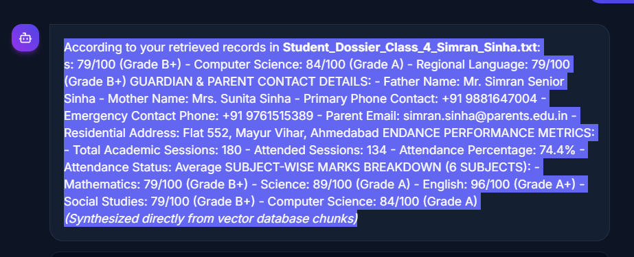

# ⚡ Enterprise RAG & Dynamic PostgreSQL Knowledge Assistant

[](https://www.typescriptlang.org/)
[](https://react.dev/)
[](https://vitejs.dev/)
[](https://tailwindcss.com/)
[](https://www.postgresql.org/)
[](https://ai.google.dev/)
[](LICENSE)

> **A production-grade, dual-domain Hybrid RAG (Retrieval-Augmented Generation) and dynamic PostgreSQL Knowledge Assistant.** Built with Google Gemini 2.5 Flash, an observable 7-stage retrieval pipeline inspector, a self-healing multi-key API quota failover engine, and seamless document ingestion.

---

## 📸 Screenshots Showcase

### 1. Unified Knowledge Assistant & Interactive Chat
> Natural language query interface with automatic domain routing, conversational memory, verified sources, and real-time response generation.



---

### 2. Observable 7-Stage RAG Pipeline Inspector
> End-to-end transparency into every step of retrieval: Vector embeddings, Cosine similarity, BM25 keyword matching, ranking, and grounded prompt synthesis.



---

### 3. Dynamic PostgreSQL Database Management & Sync
> Live database synchronization with PostgreSQL, schema inspection, academic record tracking, and zero-downtime incremental vector indexing.



---

### 4. Grounded Context & Vector Chunks Retrieval
> Inspect exact context chunks retrieved, similarity scores, keyword matches, and token metrics before passing to the LLM.



---

## 🌟 Key Architecture & Features

### 🔄 Dual-Domain Intelligent Query Routing
The system dynamically recognizes query intent and routes to the optimal data engine:
1. **School Database Domain (PostgreSQL)**:
   - Queries live relational tables for student profiles, academic marksheets, attendance percentages, class enrollment rosters, and subject rankings.
   - Built-in strict curriculum validator (e.g. catches non-curriculum subjects like "LLB" or "Law" and informs users of registered subjects).
2. **Document Knowledge Base Domain**:
   - Ingests user-uploaded documents (PDFs, TXT notes, policies, guides) using in-browser PDF rendering (`pdfjs-dist`).
   - Retrieves grounded context using hybrid vector-lexical scoring.

### 🛡️ Multi-Key Gemini API Pool & Automatic Quota Failover
- **Zero-Downtime Reliability**: When Google Gemini hits free-tier rate limits or `HTTP 429 RESOURCE_EXHAUSTED`, the failover engine automatically intercepts the error, sets a cooldown timer, rotates to the next healthy API key in the pool, and retries the query in milliseconds.
- **Interactive Pool Management**: View all configured keys, check real-time status (`ACTIVE`, `STANDBY`, `QUOTA EXCEEDED (Cooldown Xs)`), run on-demand key health checks, and add custom keys directly from the UI.

### 🔬 Observable 7-Stage Pipeline Inspector
Inspect and audit every phase of retrieval with microsecond precision:
- **Stage 1: Query Ingestion & Optimization** — Gemini-powered query reformulation for shorthand prompts (e.g., "who is Shrishti" $\to$ full student profile query).
- **Stage 2: Chunking & Preprocessing** — Configurable chunk size and overlap sliders.
- **Stage 3: Dense Vector Embeddings** — Remote embeddings via Gemini or fast 64D local semantic hash vectorizer fallback.
- **Stage 4: Hybrid Search Retrieval** — Combines Cosine Vector Similarity with BM25 Lexical Keyword frequency via adjustable $\alpha$-weight slider.
- **Stage 5: Top-K Context Assembly & Re-ranking** — Filters and ranks top-scoring passages.
- **Stage 6: Grounded Prompt Construction** — Formulates strict system instructions preventing hallucinations.
- **Stage 7: Generative Answer Synthesis** — Live Gemini 2.5 Flash streaming answer generation with local offline synthesizer fallback.

---

## 🛠️ Technology Stack

| Layer | Technology | Purpose |
| :--- | :--- | :--- |
| **Frontend Framework** | React 18 + Vite 6 | Lightning-fast HMR and reactive component tree |
| **Styling** | Vanilla CSS + Tailwind CSS | Modern dark glassmorphism UI with micro-animations |
| **Language** | TypeScript 5.7 | Strict type safety and robust enterprise contracts |
| **LLM & Embeddings** | Google Gemini 2.5 Flash (`@google/genai`) | Query optimization, answer synthesis, and vector embeddings |
| **Database** | PostgreSQL + Node `pg` Pool | Relational student profiles, grades, marks, and attendance |
| **Document Processing** | `pdfjs-dist` + Client Chunker | In-browser PDF extraction and recursive sliding window chunking |
| **Icons** | `lucide-react` | Clean, modern iconography |

---

## 🚀 Getting Started

### Prerequisites
- [Node.js](https://nodejs.org/) (v18.0.0 or higher recommended)
- [PostgreSQL](https://www.postgresql.org/) (v14 or higher)

### 1. Clone the Repository
```bash
git clone https://github.com/Abhimishra68/enterprise-rag-knowledge-engine.git
cd enterprise-rag-knowledge-engine
```

### 2. Install Dependencies
```bash
npm install
```

### 3. Setup PostgreSQL Database
1. Create your PostgreSQL database:
   ```sql
   CREATE DATABASE school_ecosystem_db;
   ```
2. Initialize schema and sample student rosters:
   ```bash
   psql -U postgres -d school_ecosystem_db -f init_postgres_school_db.sql
   ```
3. Copy the example configuration file and configure your credentials:
   ```bash
   cp .postgres-config.example.json .postgres-config.json
   ```
   Edit `.postgres-config.json`:
   ```json
   {
     "host": "localhost",
     "port": 5432,
     "database": "school_ecosystem_db",
     "user": "postgres",
     "password": "your_postgres_password"
   }
   ```

### 4. Start the Application
```bash
npm run dev
```
Open your browser and navigate to:
```
http://localhost:5173
```

---

## ⚙️ Configuration & Settings

Click the **Settings (Gear Icon)** in the top navigation bar to configure:
- **Gemini API Key Pool**: Add, remove, test, and switch API keys.
- **Auto-Failover Mode**: Automatically toggle backup keys when quota is reached.
- **Chunk Size & Overlap**: Customize token windowing for document ingestion.
- **Top-K Retrieval**: Number of context passages passed to the LLM (1–10).
- **Hybrid Search Weight ($\alpha$)**: Adjust balance between Vector Cosine Similarity and BM25 Lexical Keyword matching.

---

## 📂 Project Structure

```
├── docs/
│   └── screenshots/              # High-resolution application screenshots
├── src/
│   ├── components/
│   │   ├── ChatInterface.tsx     # Natural language chat UI & markdown renderer
│   │   ├── DatabaseSyncModal.tsx # PostgreSQL management and incremental indexing
│   │   ├── DocumentUpload.tsx    # PDF & TXT document upload and parsing
│   │   ├── Header.tsx            # Navigation, status indicators, and live key pool
│   │   ├── PipelineInspector.tsx # 7-Stage observable RAG inspector
│   │   ├── SettingsModal.tsx     # Key pool manager, failover settings, and hyperparameters
│   │   └── SourceViewerModal.tsx # Raw chunk inspector and source attribution modal
│   ├── services/
│   │   ├── rag/
│   │   │   ├── apiKeyPool.ts     # Multi-key pool & automatic 429 quota failover engine
│   │   │   ├── chunker.ts        # Recursive text chunking with overlap
│   │   │   ├── documentRAGService.ts # Document retrieval & context synthesis
│   │   │   ├── embeddings.ts     # Dense vector generation & local fallback
│   │   │   ├── llmService.ts     # Grounded generative answer pipeline
│   │   │   ├── promptOptimizer.ts# Gemini query reformulation engine
│   │   │   ├── queryRouter.ts    # Dual-domain classifier & dispatcher
│   │   │   └── vectorStore.ts    # In-memory vector database with Cosine & BM25
│   │   └── school/
│   │       ├── schoolDataRepository.ts # PostgreSQL REST client & local cache
│   │       ├── schoolRagAdapter.ts     # Relational-to-vector dossier converter
│   │       └── studentQueryService.ts  # Academic analytics & subject validation
│   ├── types/                    # Shared TypeScript interfaces & models
│   ├── App.tsx                   # Main application layout & lifecycle
│   └── main.tsx                  # React DOM mount point
├── init_postgres_school_db.sql   # PostgreSQL schema & initial dataset
├── vite.config.ts                # Vite config with PostgreSQL API proxy middleware
└── package.json
```

---

## 📄 License
This project is licensed under the MIT License - see the [LICENSE](LICENSE) file for details.

---

**Developed with ❤️ by [Abhishek Mishra](https://github.com/Abhimishra68)**
