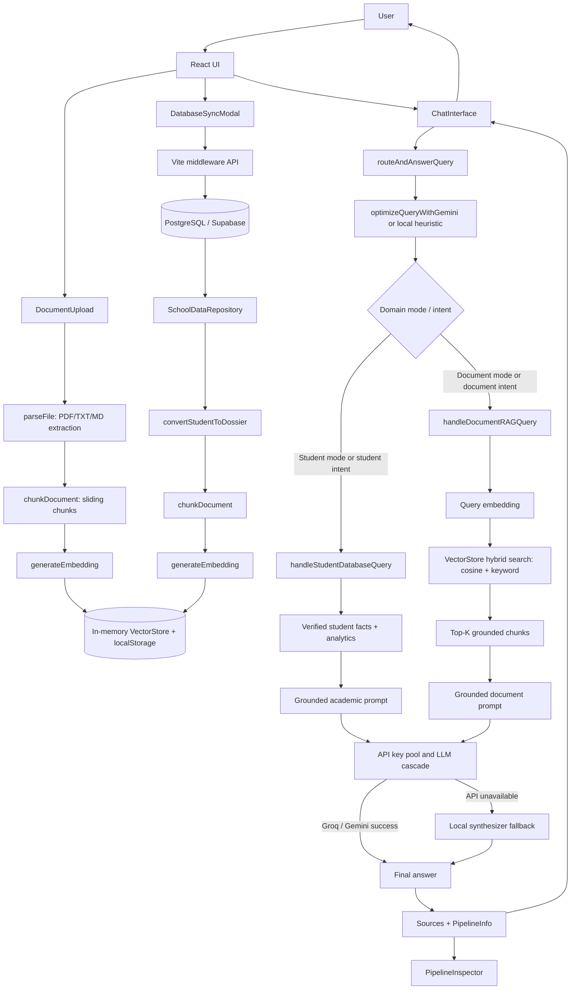
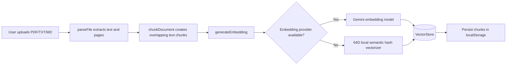
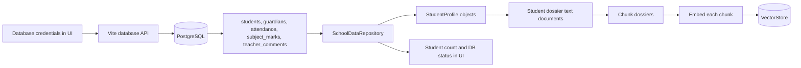
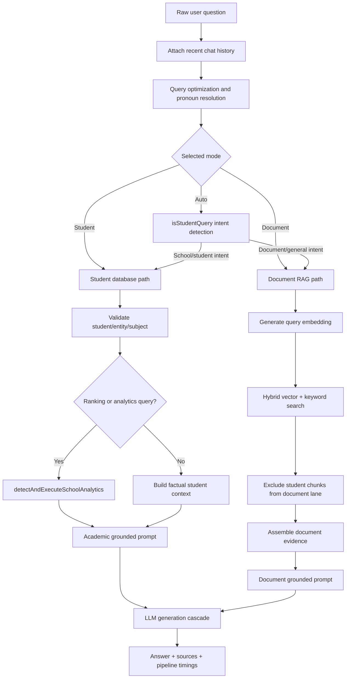
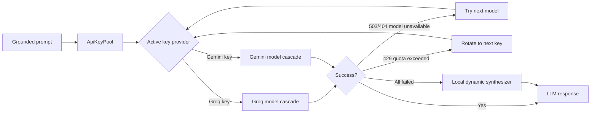

# Project Working Flow Diagram

This project is a dual-domain RAG assistant. It answers questions from two knowledge sources:

- Uploaded documents such as PDF, TXT, and Markdown files.
- School/student data from PostgreSQL, with an in-memory fallback repository and vector indexing for student dossiers.

## 1. Complete System Flow

## 2. Document Ingestion Flow

## 3. School Database Sync Flow

If PostgreSQL is not connected, the repository stays in offline/fallback mode and the UI still works with whatever student data is already available in memory.

## 4. Query Answering Flow

## 5. LLM and Failover Flow

## 6. Main Code Map

| Area | File | Responsibility |
| :--- | :--- | :--- |
| App shell | `src/App.tsx` | Owns UI state, settings, documents, chat, routing calls, modals, and pipeline inspector state. |
| Query router | `src/services/rag/queryRouter.ts` | Optimizes the question and routes it to student or document handling. |
| Document RAG | `src/services/rag/documentRAGService.ts` | Embeds query, searches uploaded document chunks, builds grounded prompt, generates answer. |
| Vector store | `src/services/rag/vectorStore.ts` | Stores chunks and runs hybrid cosine + keyword retrieval. |
| Embeddings | `src/services/rag/embeddings.ts` | Uses Gemini embeddings when available, otherwise local 64D semantic vectorizer. |
| Prompt optimizer | `src/services/rag/promptOptimizer.ts` | Rewrites vague prompts and resolves pronouns using chat history. |
| Student engine | `src/services/school/studentQueryService.ts` | Detects student queries, validates entities/subjects, builds factual school prompts. |
| School sync | `src/services/school/schoolDataRepository.ts` | Talks to database API, stores student profiles, tracks status. |
| Student indexing | `src/services/school/schoolRagAdapter.ts` | Converts student records to dossier documents and indexes them into the vector store. |
| Database backend | `vite.config.ts`, `src/server/postgresService.ts` | Provides Vite middleware API for status, config, fetch, insert, and schema initialization. |
| Pipeline UI | `src/components/PipelineInspector.tsx` | Displays the current retrieval/generation pipeline details. |

## 7. Short Working Summary

1. User uploads documents or syncs PostgreSQL student records.
2. Text is extracted, chunked, embedded, and stored in `VectorStore`.
3. User asks a question in chat.
4. The router rewrites the query and decides between the student database engine and document RAG engine.
5. The selected engine builds a strictly grounded prompt from verified facts or retrieved chunks.
6. The API key pool tries Groq/Gemini models with automatic model and key failover.
7. If cloud generation fails, the app uses a local fallback synthesizer.
8. The UI displays the answer, sources, timings, and pipeline trace.
